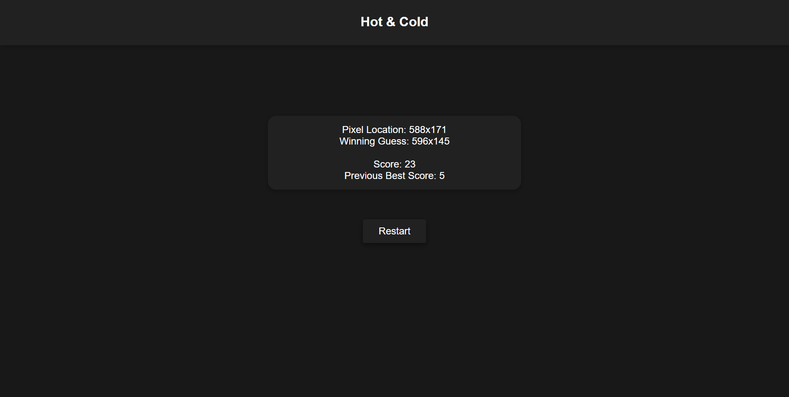

# Hot&Cold

---

### Table of Contents

- [Description](#description)
- [How To Use](#how-to-use)
- [Author Info](#author-info)

---

## Description

Hot & Cold is based on the game many of us played as kids. The purpose of the game is to click anywhere on the webpage to find the randomly generated location. This program focusses on manipulating the DOM with vanilla Javascript to gather and display information.

#### Technologies

- HTML
- CSS
- Vanilla Javascript

---

## How To Use

This project is relatively simple to use.

-Click anywhere on the webpage to guess the random location
-Look at the feedback, and guess again
-Keep adjusting your clicks based on the feedback until you find the random location
-After finding the location, check out your game stats and hit the restart button to play again

---

## Author Info

- LinkedIn - [@StephenPalazzo](https://www.linkedin.com/in/stephenpalazzo)
- Website - [Stephen Palazzo](https://stephenpalazzo.com)

[Back To The Top](#Hot&Cold)
